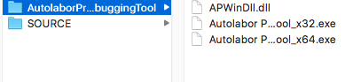
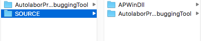
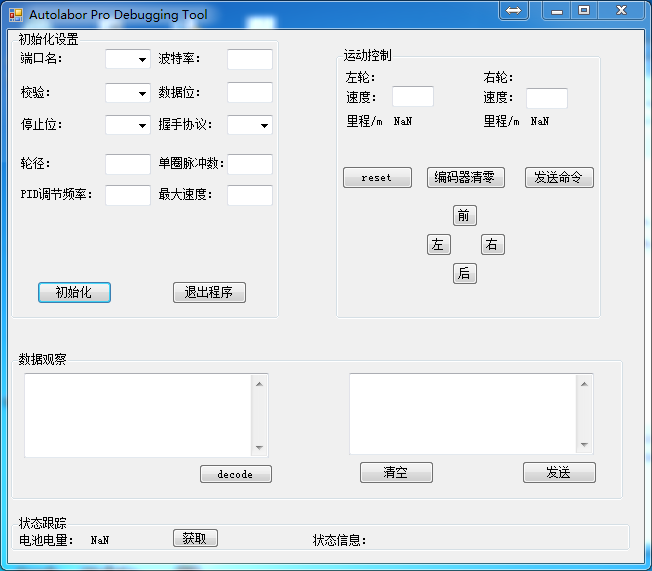
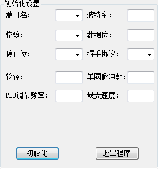
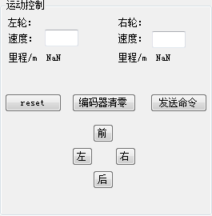
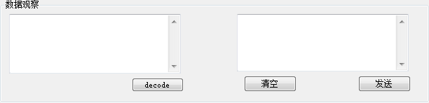
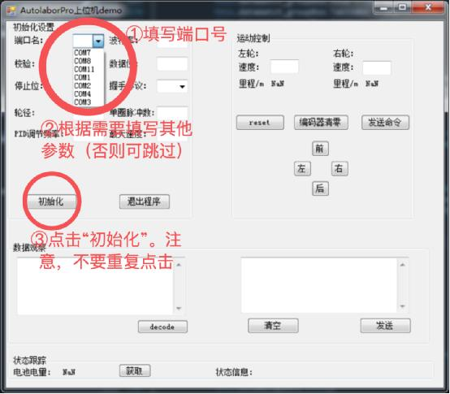
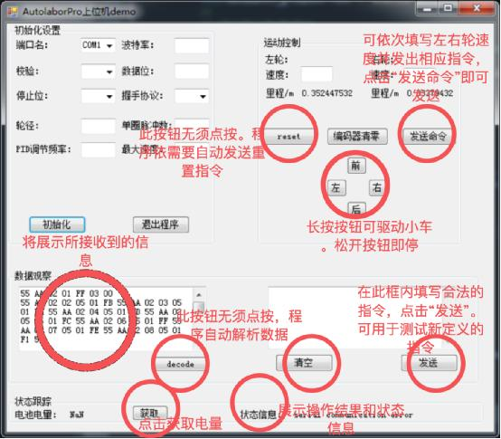

# 开发背景

为开发者提供AP系列产品 (现仅有Autolabor Pro1) 的Windows操作系统下的软件开发工具样例。

# 介绍

## 开发环境

* Windows操作系统
* Visual Studio


## 开发语言

* C++

## 结构说明
### 包括：

* 动态链接库文件 APWinDll.dll 及源码
* Windows控制示例程序 Autolabor Pro Debugging Tool(x32/x64) 及源码

### 下载
Autolabor Pro1-[资源下载](download.md)

### 文件说明：

* Autolabor Pro Debugging Tool 文件夹中分别为 APWinDll.dll 与 Autolabor Pro Debugging Tool(x32/x64) 



* SOURCE文件夹中分别为 APWinDll.dll 和 Autolabor Pro Debugging Tool 的源码



### 动态链接库文件(DLL)介绍	

#### APWinDll.dll 用途

与AP系列产品进行串口通信，收发二进制数据。可解析与封装各个指令，并将各条指令即时解析和可视化。

***

#### APWinDll.dll 功能说明

##### APProto类：
将指令分解为消息头、序号、消息载荷、校验码等结构，并提供相应的设置器，获取器，以及指令的解析与封装方法（使各个参数“各就各位”）

##### APCommand类：
对已知的AMproto对象进行读取和进行相应动作的响应

##### AMVelTransform类：
根据小车的运动模型参数，如轮径、编码器单圈脉冲数等，进行指令数据与实际速度的换算等

##### SpecialMethod类：
提供适用于AP小车通信协议的byte/int数据类型转换方法

***

#### APWinDll.dll 接口说明


***打开串口：*** ```APSerialPort:openPort();```

***关闭串口：***  ```APSerialPort:closePort();```

***开始控制线程：*** ```APSerialPort:controlStart();```

***发送数据：*** ```APSerialPort:sendBytes();```

***解析并执行：*** ```APSerialPort:decodeExecute();```

***请求电量：*** ```APSerialPort:reqBattery();```

***请求当前编码器累计计数：*** ```APSerialPort:reqWheelSpeed(short LSpeed, short RSpeed);```

***请求车轮停止驶动：*** ```APSerialPort:wheelstop();```

***请求车向右行驶：*** ```APSerialPort:goRight();```

***请求车向后行驶：*** ```APSerialPort:goBack();```

***请求车向左行驶：*** ```APSerialPort:goLeft();```

***请求车向前行驶：***  ```APSerialPort:goAhead();```

***请求重置以恢复对小车的速度控制：*** ```APSerialPort:reqReset();  ```

***
     
### Windows控制示例程序介绍

Autolabor Pro Debugging Tool 是基于 APWinDll.dll 开发的Windows控制示例程序。

该软件可作为开发者的开发示例程序，也可直接使用该软件控制AP系列产品(现仅有Autolabor Pro1)。



#### 功能介绍

* 可获取AP的电池电量与状态信息
* 可对AP进行运动控制（"前/后/左/右"按键控制，或发送串口指令）
* 可对编码器累计计数清零
* 可发送特定指令

#### 特性介绍

* 当向下位机发送串口指令，下位机回应“错误”时，程序会自动发送reset重置指令，恢复对AP的控制
* 当程序接收到信息时，会自动解析并显示数据，用户也可手动解析

#### 模块介绍

该软件有以下几个模块：

* 初始化设置
* 运动控制
* 数据观察
* 状态跟踪

##### 初始化设置

描述：使用该模块对AP产品进行初始化设置。



* 端口名为<mark>必填项</mark>，其他参数可根据需要选填(不填则为默认)
* 端口名可通过"我的电脑->设备管理器"确定当前与AutolaborPro连接的端口号。从下拉框中查找目标串口选择，若下拉中没有对应的端口号，可自行键入

默认参数：

* 波特率：115200
* 停止位：1
* 数据位：8
* 奇偶校验：无
* 握手协议：无
* 轮径：0.25米
* PID频率：50Hz
* 编码器单圈轮径：1600
* 最大速度：0.6米/秒

<mark>注意：第一次初始化后，请勿重复点按“初始化”按钮，否则该端口将拒绝访问，由此可能导致程序崩溃</mark>

##### 运动控制

描述：使用该模块对AP产品进行运动控制与编码器清零操作。



* 可长按"前/后/左/右"按键控制小车，松开按键则立即停止，长按时程序将以5Hz的频率向小车发送速度指令
* 可填写左右轮“速度”，点击“发送命令”，进行控制
* 点按“编码器清零”按键，即可使编码器清零

注意：

* 该reset按钮是在调试过程中主动重置使用，在调试过程中，如果上位机接收到下位机返回的错误信息，程序会自动发送重置指令，无需手动点击reset
* 编码器累计计数为相对数值。当计数超过65535时，计数从0开始。故里程计算时，应当计算当前编码器计数的增量，经过换算后累加得到里程数值


##### 数据观察

描述：使用该模块向AP产品发送串口指令，并显示接收到的信息。



* 右侧为输入(input)，在此编辑框内输入格式完整且正确的十六进制指令，点击"发送"按钮发送(指令规则参见Autolabor Pro使用文档中的"指令说明")
* 左侧为输出(output)，在此编辑框中将展示所接收到的信息


注意：

* 16进制指令，每字节须以空格隔开，示例如下：
 `0x 55 AA 09 00 01 00 04 00 00 00 00 00 00 F3`
 
* 接收到信息的数据格式为十六进制字符串，无需点按"decode"按键，程序会自动解析数据，得到的电量信息、状态信息（如“错误”、“重置成功”、“编码器清空失败”等）将展示在“状态跟踪”框内


##### 状态跟踪

描述：使用该模块获取AP产品的电池电量与状态信息。


* 点击电量“获取”按键获取电量信息
* 状态信息显示操作的结果和状态(success/error	)

#### 运行注意事项

* 首先确认自己的操作系统位数，选择合适版本的程序x32/x64运行
* 运行本程序的机器上需要安装 .Net Framework4.5，并可能需要相应地配置环境变量（如果打开程序时没有报错，请忽略本条）
* APWinDll.dll 与可执行文件必须在同一目录下
* 项目源码运行调试时，请在 Visual Studio 左侧解决方案页面，点击“reference”，修改 APWinDll.dll 路径，方可正确编译

### Windows控制示例程序使用说明

介绍 Autolabor Pro Debugging Tool 的使用操作。

#### 操作步骤


1. 打开对应操作系统的软件(x32/x64)
2. 将AP产品与电脑连接，查看"我的电脑->设备管理器"确定当前连接的端口号
3. 从下拉框中查找目标串口选择，若下拉中没有对应的端口号，可自行键入。端口名为必填项，其他参数可根据需要选填(不填则为默认，默认参数见【初始化设置】部分)
4. 点击初始化(注意不要重复点击)
5. 开始控制与调试，可发送各类指令：

	* 电量获取：点击“状态跟踪”栏“获取”按键，即可查看下位机电量
	
	* 运动控制：长按“运动控制”区的"前/后/左/右"按键可分别控制下位机往相应的方向运动。按键一松开，则小车停止驶动。也可以填写左右轮“速度”，点击“发送命令”，进行控制。
	* 编码器累计计数清零：点按“运动控制”区的“编码器清零”按键，即可使编码器清零。注意：编码器累计计数为相对数值。当计数超过65535时，计数从0开始。故里程计算时，应当计算当前编码器计数的增量，经过换算后累加得到里程数值。
	* 特定指令发送：可通过“数据观察”左侧发送框，填写合法的16进制指令，每字节以空格隔开。点击“发送”即可。

	




