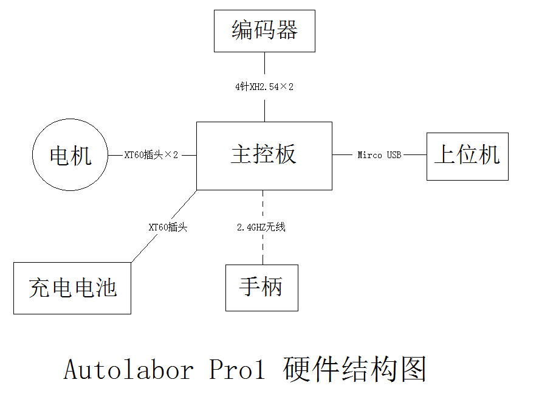

# 产品参数  

<table>
	<tr>
		<td width="20%">尺寸</td>
		<td>726*617*273mm</td>
		<td>净重</td>
		<td>35kg</td>
	</tr>
	<tr>
		<td>负载</td>
		<td>直线50kg/原地转弯30KG</td>
		<td>电池</td>
		<td>24V DC锂聚合物电池</td>
	</tr>
	<tr>	
		<td>电池容量</td>
		<td>10Ah/18Ah（选配）</td>
		<td>续航时间</td>
		<td>2.5h/4h</td>
	</tr>
	<tr>
		<td>辅助电源</td>
		<td>3*12V 1*5V</td>
		<td>最大速度</td>
		<td>0.8m/s</td>
	</tr>
	<tr>
		<td>驱动方式</td>
		<td>四驱</td>
		<td>转向方式</td>
		<td>差速转向</td>
	</tr>
	<tr>
		<td>通信接口</td>
		<td>RS232串口 115200bps</td>
		<td>编码器精度</td>
		<td>物理：400线 逻辑：1600线（四倍频）</td>
	</tr>
	<tr>
		<td>PID控制频率</td>
		<td>50Hz</td>
		<td>适用地形</td>
		<td>全地形</td>
	</tr>
	<tr>
		<td>垂直越障能力</td>
		<td>8cm</td>
		<td>爬坡能力</td>
		<td>25°</td>
	</tr>
	<tr>
		<td>支持系统</td>
		<td>Windows/Linux</td>
		<td>支持平台</td>
		<td>X86</td>
	</tr>
	<tr>
		<td>手柄控制</td>
		<td>20m</td>
		<td>手柄通讯</td>
		<td>2.4Ghz</td>
	</tr>
</table>

# 尺寸参数

* * *

# 控制手柄参数
该手柄有自动休眠功能，长时间不操作，省电模块被激活后自动进入休眠模式，按下START键即可唤醒手柄。  

参数名称  | 参数内容
:-------------: | :-------------:
电池 |  AAA（7号）电池\*2
使用时间  |  约10小时
无线频率  |  2.4GHz
接收范围  |  20m

* * *

# 控制面板使用  

 

控制面板清单：  
  
名称  | 个数 | 说明
:-------------: | :-------------: | :-------------:
紧急停止 |  1 | 在紧急情况下请按下该紧急停止按钮
电源 | 1 | 电源开启关闭按钮
充电接口（IN）  |  1 | 为内置电池充电
电量显示  |  1 | 以百分比的形式显示AP1电池电量
12V电源输出（OUT）  |  3 | 12V内置电源输出接口
5V电源输出（OUT）  |  1 | 5V内置电源输出接口
上位机控制 | 1 | 切换手柄控制与上位机控制按钮
RS232串口 | 1 | 使用串口数据线连接下位机与上位机，进行通信

* * *

# 熔断式保险或空气开关

   当AP1意外出现短路、过载的情况时，熔断式保险或空气开关会主动切断电池的回路。
   
   空气开关：
   
  
  
  旧型号的AP1内部为熔断式保险，规格：中号40A。
  
  

# 硬件结构

# 电路板图

# 电路原理图
[下载](http://www.autolabor.com.cn/download)

