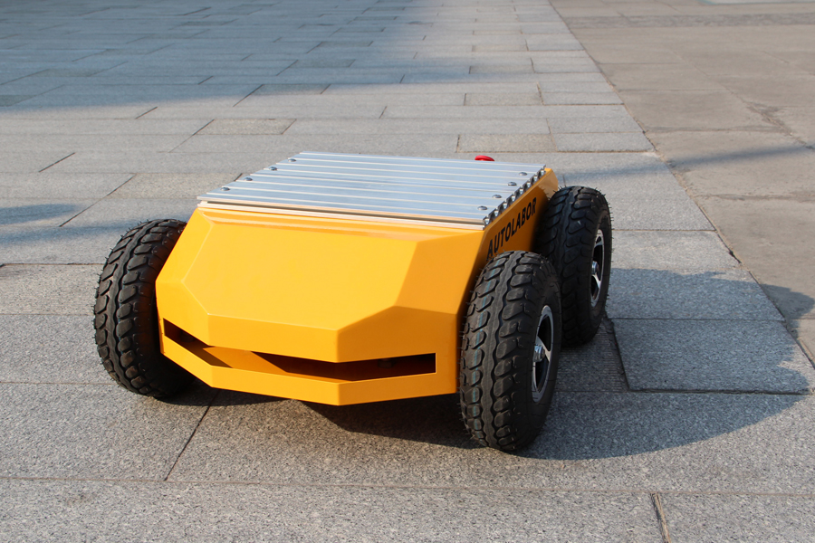

# 产品概述
Autolabor Pro1(AP1)机器人移动开发平台是一款集模块化、简洁化、可定制为一身的机器人底盘，适用于机器人教育培训、科学研究和产品开发等。具有通过性强、负载能力大、精度高、动力足、续航长和扩展性高等特点，可跨平台开发，支持多种应用场景。

* * *

# 主要特性
*  可靠耐用，操作简单，无需组装，开机直接使用
*  高通过性，爬坡能力十足，续航能力强
*  高精度工业级编码器，定位精准
*  高负载，负重可达50KG
*  适应场景广泛，室内外均可使用
*  兼容多个系统，支持多种开发平台、控制方式
*  支持ROS开发，提供ROS驱动包与运动模型
*  雷达、摄像头、惯导等多种传感器随意组合搭配，拆装方便  
*  使用文档齐全，配备后续用户支持，并不断更新开发教程

* * *

# 产品照片

* * *

# 产品视频

<iframe frameborder="0" width="640" height="498" src="https://v.qq.com/txp/iframe/player.html?vid=c0504lse3je&tiny=0&auto=0" allowfullscreen></iframe>

* * *

# 产品清单

名称 | 数量 | 备注
:---:|:---:|---
AP1移动平台 | 1辆 |
AP1充电器 | 1个 | 
AP1控制手柄| 1套 | 含电池
串口数据线 | 1根 | 
20cm支架  | 2套 | 
30cm支架 | 2套 | 
辅助电源供电线 | 3个 |  
配套工具 | 1套 |

* * *

# 使用提醒

* 产品边缘锋利，请小心接触，避免划伤
* 产品表面为金属材质，请勿与电路板直接接触
* 操控平台时避免速度过快，引起碰撞
* 搬运时以及设置作业时，请勿落下或倒置
* 非专业人员，请不要私自拆卸
* 不使用非原厂标配的电池、电源、充电座
* 运行时请勿用手触碰
* 不要在有水的地方，存在腐蚀性、易燃性气体的环境内和靠近可燃性物质的地方使用
* 不要放置在加热器或者大型卷线电阻器等发热体周围
* 切勿将电机直接与商用电源连接

* * *

# 电池安全
* 请在有人看护的状态下充电，若人员离开请拔掉充电插头
* 充电器在充电工作时，会向外界散发一定的热量，充电器与产品应放在通风干燥的环境中使用
* 正常充电时，充电指示灯为红色，当转为绿色时为充满
* 停止充电时，应先拔下插头，然后取下电池端插头
* 产品长期不用，需三个月至半年补充一次电
* 产品电池不可将电完全用完，否则会严重受损，容易造成不可修复

* * *