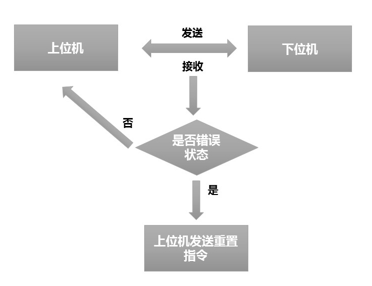
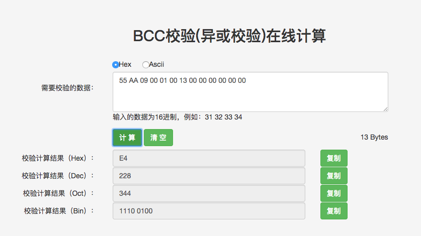

## 协议概述  

本协议是一种用于AP1上位机与下位机之间通信的自定义通信协议，波特率为115200，以16进制格式传输。上位机向下位机发送请求（commands），下位机在收到来自上位机的请求后，作出相应的反应并返回应答（feedback）至上位机，帧结构说明如下。

## 帧结构说明
数据帧分为5个部分：起始标志位/帧头（Header），数据长度（Length），序列号（Sequence），有效载荷数据（Payload），检验码（Checksum）。

数据帧结构如下表所示：

<table>
	<tr align="center">
		<th style="background-color:#374F7F;color:#fff;">Name</th>
		<td>Header</td>
		<td>Length</td>
		<td>Sequence</td>
		<td>Payload</td>
		<td>Checksum</td>
	</tr>
	<tr align="center">
		<th style="background-color:#374F7F;color:#fff;">Size</th>
		<td>2 Byte</td>
		<td>1 Byte</td>
		<td>1 Byte</td>
		<td>N Bytes</td>
		<td>1 Byte</td>
	</tr>
</table>

### 起始标志位/帧头（Header）
起始标志位，即为我们常说的帧头，以固定不变的“55AA”作为起始标志位，标志着一帧的开始。

### 数据长度（Length）
数据长度，其值表示数据包Payload的长度。

### 序列号（Sequence）
帧的序列号从0开始，范围为0~255，消息的发送端每发送一个帧将该字段的值加1，接收端可以根据该字段是否连续，判断是否有丢包的情况发生。

### 有效载荷数据（Payload）
有效载荷数据，即实际数据内容，考虑到数据传输效率与可扩展性，本协议将Payload的长度设计为非固定长度，可适应不同的消息类型。

Payload分为两部分：MsgID和PARAM。

<table>
	<tbody>
		<tr align="center">
			<td colspan="2">Payload</td>
		</tr>
		<tr>
			<td align="center">MsgID</td>
			<td align="center">PARAM</td>	
		</tr>
		<tr>
			<td>指令的类型</td>
			<td>指令的内容</td>	
		</tr>
	</tbody>
</table>

Payload指令如下表所示:  
<table>
	<tbody>
		<tr align="center">
			<th width="5%">Name</th>
			<th>Type</th>
			<th>MsgID</th>
			<th colspan="4" width="35%">PARAM</th>
			<th colspan="2">Description</th>
		</tr>
		<tr align="center">
			<td rowspan="4">车轮速度指令</td>
			<td rowspan="2">发送</td>
			<td rowspan="2">01</td>
			<td width="8%">00 00</td>
			<td width="8%">00 00</td>
			<td width="8%">00 00</td>
			<td width="8%">00 00</td>
<td rowspan="2" align="left" colspan="2">  
			
* AP1是2电机4轮驱动模式，左/右两侧的两个轮子各由一个电机驱动。因此左边的两个轮子的速度是相同的，在发送左/右轮速度时，仅需发送一个轮子的速度，每个轮速是2个字节  
* PARAM中前2个字节设置左轮的速度，接着2个字节设置右轮的速度，后面4个字节全部置0，用于后续拓展四轮控制  
* 当我们改变车轮的速度的时候，其实是改变车轮编码器的计数，例如给左轮一个0.1m/s前进的速度，即给出的指令是0004，则需要通过计算将车轮速度转化为编码器的计数，后面会讲到如何计算
</td>
		</tr>
		<tr align="center">
			<td>左轮</td>
			<td>右轮</td>
			<td colspan="2">空字段，用于后续扩展</td>
		</tr>
		<tr align="center">
			<td rowspan="2">接收</td>
			<td rowspan="2">01</td>
			<td width="8%">00 04</td>
			<td width="8%">00 00</td>
			<td width="8%">00 00</td>
			<td width="8%">00 00</td>
			<td align="left" colspan="2" rowspan="2">返回的数据是当前时刻车轮编码器的累计计数</td>
		</tr>
		<tr align="center">
			<td>左轮</td>
			<td>右轮</td>
			<td colspan="2">空字段，用于后续扩展</td>
		</tr>
		<tr align="center">
			<td rowspan="2">电池电量指令</td>
			<td>发送</td>
			<td>02</td>
			<td colspan="4">00</td>
			<td colspan="2" align="left">请求电池电量</td>
		</tr>
		<tr align="center">
			<td>接收</td>
			<td>02</td>
			<td colspan="4">32</td>
			<td align="left" colspan="2">返回的数据为0~100电量区间的16进制表达，例如电量为50，则返回32</td>
		</tr>
		<tr align="center">
			<td rowspan="3">重置状态指令</td>
			<td>发送</td>
			<td>05</td>
			<td colspan="4">00</td>
<td align="left" colspan="2">

**<mark>注：当上位机在发送指令后，接收到错误状态信息FF时，必须发送重置指令，重置后才能恢复对下位机的控制</mark>**

</td>
		</tr>
		<tr align="center">
			<td rowspan="2">接收</td>
			<td>05</td>
			<td colspan="4">01</td>
			<td align="left" colspan="2">返回操作成功</td>
		</tr>
		<tr align="center">
			<td>05</td>
			<td colspan="4">00</td>
			<td align="left" colspan="2">返回操作失败</td>
		</tr>
		<tr align="center">
			<td rowspan="3">清除编码器计数指令</td>
			<td>发送</td>
			<td>06</td>
			<td colspan="4">00</td>
			<td align="left" colspan="2">对编码器计数清零</td>
		</tr>
		<tr align="center">
			<td rowspan="2">接收</td>
			<td>06</td>
			<td colspan="4">01</td>
			<td align="left" colspan="2">返回操作成功</td>
		</tr>
		<tr align="center">
			<td>06</td>
			<td colspan="4">00</td>
			<td align="left" colspan="2">返回操作失败</td>
		</tr>
		<tr align="center">
			<td rowspan="4">错误状态指令</td>
			<td rowspan="4">接收</td>
			<td>FF</td>
			<td colspan="4">01</td>
			<td align="left">电池没电</td>
			<td rowspan="4" width="20%" align="left" valign="top">当上位机向发送请求，下位机发生错误无法执行指令时，会向上位机返回相应的错误信息</td>
		</tr>
		<tr align="center">
			<td>FF</td>
			<td colspan="4">02</td>
			<td align="left">电流过大</td>
		</tr>
		<tr align="center">
			<td>FF</td>
			<td colspan="4">03</td>
			<td align="left">串口通信故障</td>
		</tr>
		<tr align="center">
			<td>FF</td>
			<td colspan="4">04</td>
			<td align="left">车轮卡死</td>
		</tr>
	</tbody>
</table>
错误状态处理流程图：

 

  
  
### 检验码(Checksum)  

为保证上位机与下位机所传输数据的无误性与一致性，本协议采用异或（XOR）校验的方式，根据具体发送的指令生成异或校验码，校验的数据包括帧头55AA，用户可以使用在线的[异或校验计算器](http://www.ip33.com/bcc.html)来计算，如下图所示**计算结果（Hex）**即时我们所需的异或校验码。

 

