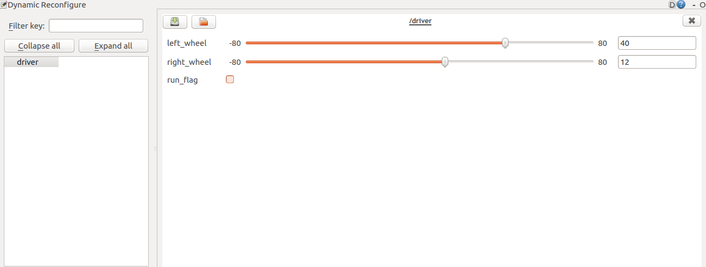

# ROS驱动包(ROS Driver Package)

ROS驱动包(ROS Driver Package)是为使用ROS开发的用户，提供上位机与下位机通讯的驱动包（[下载](http://www.autolabor.com.cn/download)）。
### 订阅的话题  
/cmd\_vel ([geometry_msgs/Twist](http://docs.ros.org/api/geometry_msgs/html/msg/Twist.html))
控制下位机运动的速度指令
	
### 发布的话题
/wheel\_odom ([nav_msgs/Odometry](http://docs.ros.org/api/nav_msgs/html/msg/Odometry.html))  
轮速里程计  

/remaining\_battery ([std_msgs::Int32](http://docs.ros.org/hydro/api/std_msgs/html/msg/Int32.html))  
剩余电池电量  

/current([std_msgs::Float32](http://docs.ros.org/hydro/api/std_msgs/html/msg/Float32.html))  
电压信息  

/voltage([std_msgs::Float32](http://docs.ros.org/hydro/api/std_msgs/html/msg/Float32.html))  
电压信息

### 参数

| 参数  | 名称  | 备注  |
| :------------ | :------------ | :------------ |
| ~port_name (str, default: /dev/ttyUSB0)  | 串口名称  |   |
| ~odom_frame (str, default: odom)   | odom  |   |
| ~base_frame (str, default: base_link)   |  base_link |   |
| ~baud_rate (int, default: 115200)   |  波特率  |   |
| ~control_rate (int, default: 10)  | 控制频率  |   |
| ~sensor_rate (int, default: 5)  |  请求电池电量频率   |   |
| ~reduction_ratio (double, default: 1)   | 减速比    |   |
| ~encoder_resolution (double, default: 1600)   | 编码器的编码数    |   |
| ~wheel_diameter (double, default: 0.25)    | 车轮直径    |   |
| ~model_param_cw (double, default:0.8)  |  顺时针旋转运动模型参数 | 注：2018.5.9前购买产品的用户，此参数为0.83  |
| ~model_param_acw (double, default:0.8)  | 逆时针旋转运动模型参数  | 注：2018.5.9前购买产品的用户，此参数为0.83  |
| ~pid_rate (double, default:50.0)    | PID控制周期   |   |

### TF转换

odom → base_link

### 驱动示例
	
	
	<launch>
	    <node name="autolabor_driver" pkg="autolabor_pro1_driver" type="autolabor_pro1_driver" output="screen">
	        <param name="port_name" value="/dev/ttyUSB0" />
	        <param name="odom_frame" value="odom" />
	        <param name="base_frame" value="base_link" />
	
	        <param name="baud_rate" value="115200" />
	        <param name="control_rate" value="10" />
	        <param name="sensor_rate" value="5" />
	
	        <param name="reduction_ratio" value="1.0" />
	        <param name="encoder_resolution" value="1600.0" />
	
	        <param name="wheel_diameter" value="0.25" />
	        <param name="model_param_cw" value="0.8" />
	        <param name="model_param_acw" value="0.8" />
	        <param name="pid_rate" value="50.0" />
			<param name="maximum_encoding" value="32.0" />
	   </node>
	</launch>
	
### 驱动启动方法

1. 将ROS驱动放入工作空间catkin_ws/src
2. 回到catkin_ws根目录下
3. 打开terminal
3. 执行 
		source /opt/ros/kinetic/setup.bash
4. 执行 
		caktin_make
5. 执行 
		source devel/setup.bash
6. 执行 
		roslaunch autolabor_pro1_driver driver.launch 

驱动启动后，可以给小车发送速度指令。此时须将底盘架起来，车轮悬空。

### 速度指令发送

1. 打开一个terminal
2. 执行 rostopic list 查看有无/cmd_vel 话题
3. 如果有的话，执行：

		rostopic pub -r 10 /cmd_vel geometry_msgs/Twist -- '[0.0,0.0,0.0]' '[0.0,0.0,1]'
	
此时车轮会开始转动，如果想要停止的话，必须在执行命令的terminal中执行Ctrl+C，停止发送。

关于指令参数的详细介绍，请参考ROS官网 [Using rostopic pub](http://wiki.ros.org/ROS/Tutorials/UnderstandingTopics)

 
	
### 常见问题
* 如果启动的时无法找到端口，请使用以下命令，查看是否存在该目录 /dev/ttyUSB0
		
		ll /dev/ttyUSB0
		
* 若不存在，请检查：  

	1. 串口线是否插好
	2. 小车电源是否打开
	3. 如果上述都没有问题，请查询是否是其他的USB端口，如/dev/ttyUSB1或/dev/ttyUSB2
		
* 如果存在目录，但启动显示权限不足，请使用以下命令进行赋权
	
			sudo chmod 666 /dev/ttyUSB0 	
		
# ROS驱动调试助手

该驱动还为用户提供了一个调试的节点，可以使用该节点直接向驱动板发送串口指令，进行指令速度与实际运行速度的校准或调整模型等工作。

### 使用步骤
1. 创建并启动launch文件，示例如下  

	
		<launch>
		    <node name="driver" pkg="autolabor_pro1_driver" type="sim_autolabor_pro1_driver" output="screen">
				<param name="port_name" value="/dev/ttyUSB0" />
				<param name="baud_rate" value="115200" />
				<param name="control_rate" value="10" />
				<param name="pid_rate" value="50" />
		    </node>
		</launch>
	
2. 打开新终端，输入以下命令，打开操作界面（如下图）

		rosrun rqt_reconfigure rqt_reconfigure
		
	  
	
3. 调整 left\_wheel 与 right\_wheel的数值，可独立控制左/右轮转速，勾选 run\_flag，即可向小车发送速度指令

注：调整的数值为一个PID控制周期下，预期编码器的变化数，详细的计算方法可参见控制车轮速度指令中的**[编码器计数计算方法](controlRule#caculate-method)**

