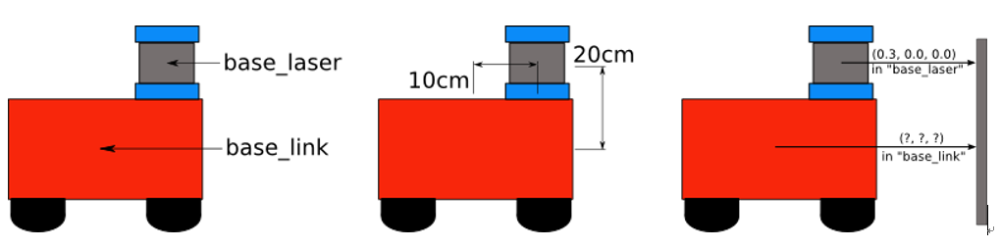
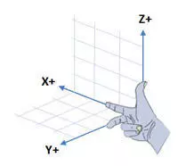
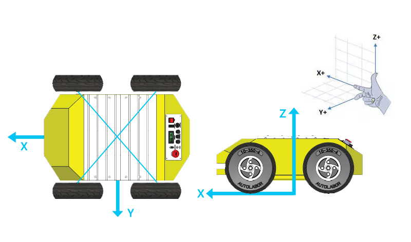
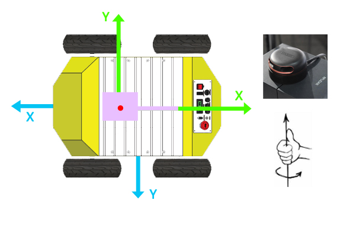
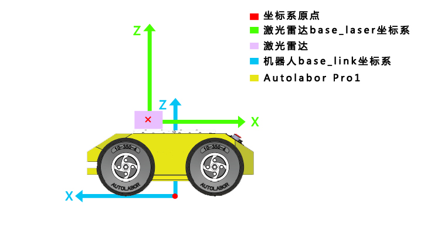

## 激光雷达

我们购买了机器人底盘Autolabor Pro1后，都会在其上加些传感器实现一些应用，无论使用什么传感器，都需要面对不同坐标系的转换关系问题，即我们常说的TF坐标变换。

### TF是什么？

[tf介绍](http://wiki.ros.org/tf)

>tf is a package that lets the user keep track of multiple coordinate frames over time. tf maintains the relationship between coordinate frames in a tree structure buffered in time, and lets the user transform points, vectors, etc between any two coordinate frames at any desired point in time.

简单来说是持续追踪多个坐标系内的变化情况，将坐标系与坐标系连接起来，使用tf树定义不同坐标系之间的平移与旋转变换关系。

### 为什么需要TF坐标变换？

在ROS中定义了许多坐标系，有机器人坐标系(base_link)，有雷达坐标系(base_laser)，地图坐标系(map)，里程计坐标系(odom)等。

以机器人中心为原点的坐标系，称为base_link坐标系，以激光雷达中心为原点的坐标系，称为base_laser坐标系。

以下图机器人与激光雷达为例



>假设在机器人运行过程中，激光雷达可以采集到距离前方障碍物的数据，这些数据当然是以激光雷达为原点的测量值，换句话说，也就是base_laser参考系下的测量值。现在，如果我们想使用这些数据帮助机器人完成避障功能，当然，由于激光雷达在机器人之上，直接使用这些数据不会产生太大的问题，但是激光雷达并不在机器人的中心之上，在极度要求较高的系统中，会始终存在一个雷达与机器人中心的偏差值。这个时候，如果我们采用一种坐标变换，将及激光数据从base_laser参考系变换到base_link参考下，问题不就解决了么。这里我们就需要定义这两个坐标系之间的变换关系。

以思岚激光雷达为例，讲解Autolabor Pro1与激光雷达的tf坐标变换。

###  补充知识：ROS坐标系

在ROS中，坐标轴规定可以参考 [ROS-REP 103](http://www.ros.org/reps/rep-0103.html) ，坐标系可以参考 [ROS-REP 105](http://www.ros.org/reps/rep-0105.html)，常规用来表示三维位置关系时，使用的是右手坐标系，对于一个三维空间里面的旋转，可以分解成绕着坐标轴的旋转，旋转的方向使用右手法则定义。

> **右手坐标系定义[^1]**
> 把右手放在原点的位置，使大姆指，食指和中指互成直角，把 **大姆指** 指向 **Z轴** 的正方向，**食指**指向**X轴**的正方向时向时，**中指**所指的方向就是 **Y轴** 的正方向



通常相对于我们的身体而言

-   X -\> 朝前
-   Y -\> 朝左
-   Z -\> 朝上

> **绕坐标轴旋转定义**
> 用右手握住坐标轴，**大拇指** 的方向朝着坐标轴**朝向的正方向**，**四指环绕的方向**定义沿着这个坐标轴**旋转的正方向**

一般来说

-   绕 **Z轴** 旋转，称之为 **航向角**，使用yaw表示;
-   绕 **X轴** 旋转，称之为 **横滚角**，使用roll表示;
-   绕 **Y轴** 旋转，称之为 **俯仰角**，使用pitch表示;

我们通常用来表述小车运动的二维平面指的是 X-Y平面，也就是X轴和Y轴张成的平面，在这个平面中，用来描述 小车转弯的角就是绕Z轴的旋转，也就是经常说的航向角。Z轴朝上，所以按照右手法则可以知道小车向 左转为正，右转为负。


### Autolabor Pro1 base_link坐标系

以机器人四轮接触面为X-Y平面，四轮轴心连线的点做垂线，与x-y平面的交点为base_link坐标系原点，车头朝向方向为X轴，正左方向为Y轴，向上为Z轴。




以思岚激光雷达为例，我们一般在安装时都习惯将雷达不带线的一端朝车头方向，雷达USB端的朝车尾方向（如下图）。



### 思岚激光雷达base_laser坐标系

雷达正中心为坐标原点，USB端的方向为X轴正方向，正左方向为Y轴，向上为Z轴。




测量雷达中心相对机器人坐标原点(0,0,0)的距离，得到雷达在机器人坐标系中(x:0.1,y:0.0,z:0.2)（ROS中长度单位为米/m）。

前面我们提到，思岚雷达的X轴正方向与机器人的X轴正方向为相反方向，雷达坐标系需要绕Z轴顺时针旋转180度才能与机器人base_link坐标系重合 ，旋转(yaw:3.14,roll:0,pitch:0)（ROS中角度单位为弧度/rad）。

根据这些数据，当我们获取激光数据后，采用(x: 0.1m, y: 0.0m, z: 0.2m, yaw:3.14, roll:0, pitch:0)的坐标变换，就可以将数据从base_laser参考系变换到base_link参考系，这就定义出了两个参考系之间的变换关系。

>从上边的示例看来，参考系之间的坐标变换好像并不复杂，但是在复杂的系统中，存在的参考系可能远远大于两个，如果我们都使用这种手动的方式进行变换，估计很快你就会被繁杂的坐标关系搞蒙了。ROS提供的tf变换就是为解决这个问题而生的，tf功能包提供了存储、计算不同数据在不同参考系之间变换的功能，我们只需要告诉tf树这些参考系之间的变换公式即可，这颗tf树就可以通过树的数据结构，管理我们所需要的参考系变换。

>为了定义和存储base_link和base_laser两个参考系之间的关系，我们需要将他们添加到tf树中。从树的概念上来讲，tf树中的每个节点都对应一个参考系，而节点之间的边对应于参考系之间的变换关系。tf就是使用这样的树结构，保证每两个参考系之间只有一种遍历方式，而且所有变换关系，都是母节点到子节点的变换。

>为了定义参考系，我们需要定义两个节点，一个对应于base_link参考系，一个对应于base_laser参考系。为了创建两个节点之间的边，我们首先需要决定哪一个节点作为母节点，哪一个节点作为子节点，这一点在tf树中是非常重要的。这里我们选择base_link作为母节点，这样会方便后边为机器人添加更多的传感器作为子节点。

详细了解 | [TF坐标变换的学习](https://blog.csdn.net/zhu751191958/article/details/79005557)

所以，从base_link节点到base_laser节点的变换关系为(x: 0.1m, y: 0.0m, z: 0.2m, yaw:3.14, roll:0, pitch:0)，设置完毕后，我们就可以通过调用tf库，完成base_laser参考系到base_link参考系的数据坐标变换了。


###  如何发布tf变换关系

[static_transform_publisher介绍](http://wiki.ros.org/tf#static_transform_publisher)

>static_transform_publisher is designed both as a command-line tool for manual use, as well as for use within roslaunch files for setting static transforms.

我们最常使用的是tf包中的static_transform_publisher，它即可在命令行直接运行，也可写在launch文件中配置坐标转换关系。


>Publish a static coordinate transform to tf using an x/y/z offset in meters and yaw/pitch/roll in radians. (yaw is rotation about Z, pitch is rotation about Y, and roll is rotation about X). The period, in milliseconds, specifies how often to send a transform. 100ms (10hz) is a good value.

使用示例：

```
<node pkg="tf" type="static_transform_publisher" name="base_link_to_laser" args="0.065 0.0 0.245 1.57 0.0 0.0 /base_link /lidar 50" />
```

这是我们最常看到的使用方法，写在launch文件中。

pkg：包名，tf
type：类型，static_transform_publisher
name：名称，自定，便于理解
arg：tf参数， x y z yaw pitch roll frame_id child_frame_id period_in_ms.

1.x y z 分别代表着相应轴的平移，单位是 米。
2.yaw pitch roll 分别代表着绕z y x 三个轴的转动，单位是 弧度。
3.frame_id 为坐标系变换中的父坐标系， child_frame_id为坐标系变换中的子坐标系。
4.period_in_ms 为发布频率，单位为 毫秒。通常取100。一毫秒为一秒的千分之一，100毫秒即为0.1秒，也就是10Hz。


按照前文的数据，args处参数修改为

```
0.1 0.0 0.2 3.14 0.0 0.0 /base_link /lidar 50
```

说明：传感器的frame_id的名称根据厂商或有不同，一般在驱动启动launch可查看，思岚激光雷达的frame_id为/lidar。

详细了解 | [tf之static_transform_publisher](https://blog.csdn.net/tiancailx/article/details/78910317)
