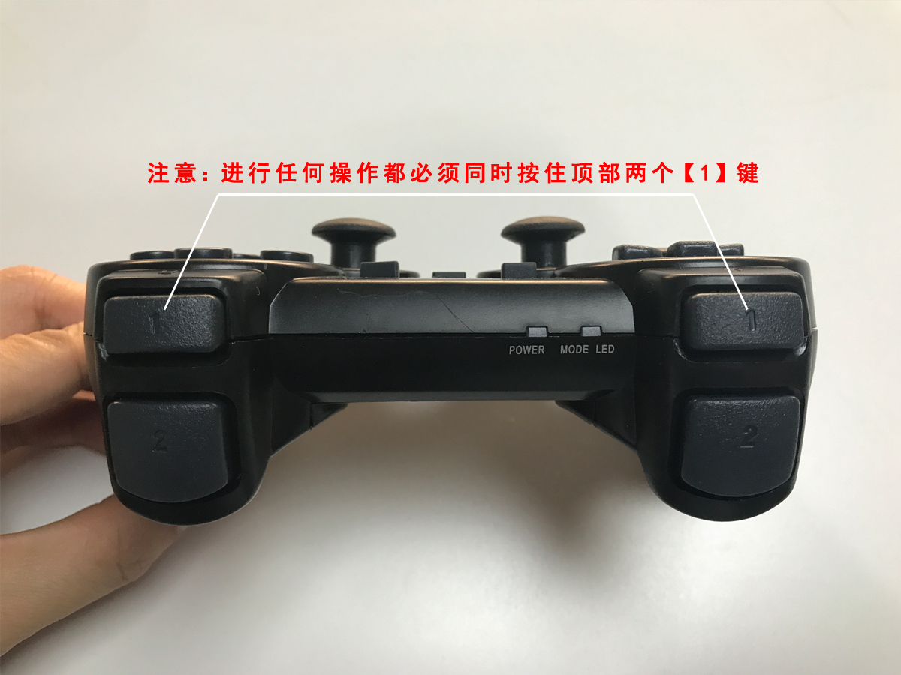
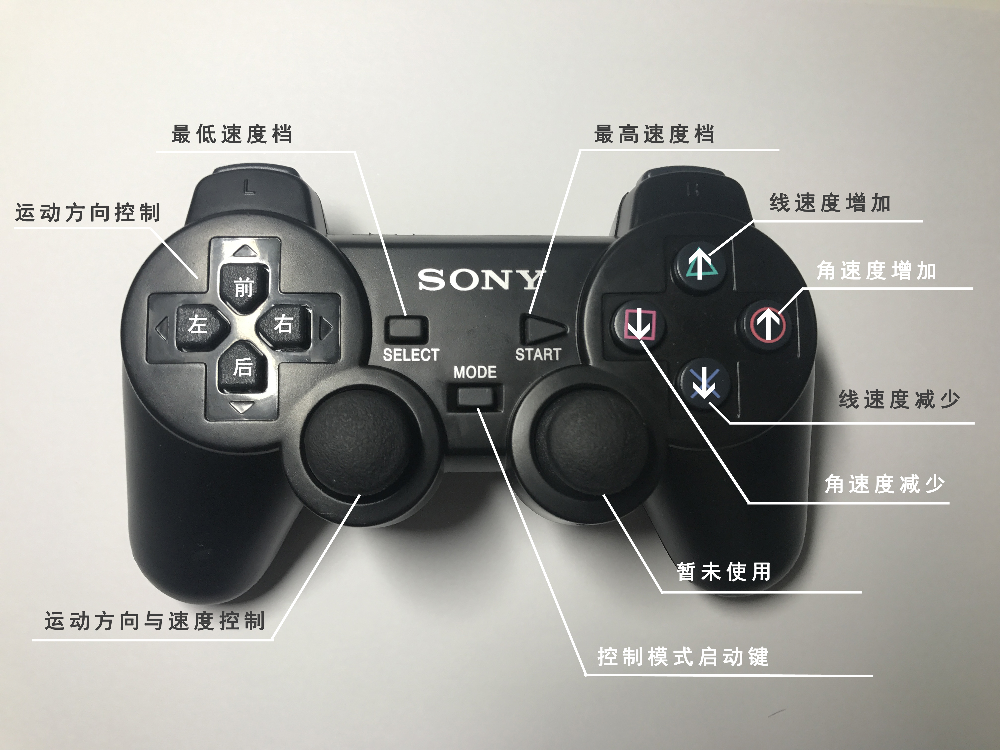

# 控制方式
AP1可以使用手柄控制和上位机控制两种方式来控制，下面将分别概述这两种控制方式。

## 手柄控制

### 概述

我们配送一个控制手柄用于控制AP1移动。
  
### 使用说明

AP1出厂默认控制模式为手柄控制，在控制面板中可切换控制模式，将AP1控制面板中的上位机控制按钮置于关闭状态切换到手柄控制模式，即可操作手柄的按键控制移动平台。

#### 手柄操作步骤

1. 打开手柄电源，切换至ON模式，手柄顶部POWER指示灯亮起  
2. 使用MODE键开启控制模式，顶部MODE LED指示灯为红色时，才能使用手柄进行控制  
3. 先按住手柄顶部两个【1】键，然后按照下文使用说明操作

#### 手柄按键说明

我们对于AP1的手柄控制设计有几种速度档位，如下表。

<table>
	<tr align="center">
		<th>档位</th>
		<td>0档</td>
		<td>1档</td>
		<td>2档</td>
		<td>3档</td>
	</tr>
	<tr align="center">
		<th>速度</th>
		<td>25%</td>
		<td>50%</td>
		<td>75%</td>
		<td>100%</td>
	</tr>
</table> 

<table>
	<tr>
		<th>按键</th>
		<th>功能</th>
		<th width="50%">备注</th>
	</tr>
	<tr>
		<td>左区4控制键</td>
		<td>前/后/左/右控制运动方向</td>
		<td></td>			
	</tr>
	<tr>
		<td>SELECT/最低速度档</td>
		<td>设置运动速度为最低档位</td>
		<td>设置速度档位为0档</td>			
	</tr>
	<tr>
		<td>START/最高速度档</td>
		<td>设置运动速度为最高档位</td>
		<td>设置速度档位为3档</td>			
	</tr>
	<tr>
		<td>左侧摇杆键</td>
		<td>控制AP1的运动方向和速度</td>
		<td>使用摇杆灵活的控制运动角度与速度，不必受限于正前/后/左/右，控制摇杆推动的力度来控制速度档位的调节，将摇杆向前方直接推到低，则直接是3档，向后方直接推到底，则直接设置为0档</td>			
	</tr>
	<tr>
		<td>右侧摇杆键</td>
		<td>无功能</td>
		<td>现阶段暂未使用</td>			
	</tr>
	<tr>
		<td>右区控制键-上</td>
		<td>线速度增加</td>
		<td>调整速度档位，每按一下，速度提高一档，最高不得高于最高档，如3档</td>			
	</tr>
	<tr>
		<td>右区控制键-下</td>
		<td>线速度减少</td>
		<td>每按一下，速度降低一档，最低不得高于最底档，如0档</td>			
	</tr>
	<tr>
		<td>右区控制键-左/右</td>
		<td>角速度增加/减少</td>
		<td>同线速度</td>			
	</tr>
	<tr>
		<td>顶部名为“1”的按键</td>
		<td>运动控制使能</td>
		<td>在遥控底盘运动、调整线速度、调整角速度的时候，这两个按钮应该处于被按下的状态</td>			
	</tr>
		<tr>
		<td>顶部名为“2”的按键</td>
		<td>配对测试按键</td>
		<td>当按下其中任意一个名为“2”的按键后，如果配对的机器人是下位机模式，那么底盘会发出蜂鸣音提示</td>			
	</tr>
</table>

		

* * *

## 上位机控制
### 概述
使用AP1配送的串口数据线与上位机相连，按照预定义的**[协议规则](/usedoc/autolaborPro1/protocolRule)**，向下位机（底层硬件平台）发送指令，控制移动平台。

### 使用说明
将AP1控制面板中的上位机控制按钮置于开启状态，使用接口线将下位机与上位机连接起来，向下位机发送指令。

### 指令发送方式
用户可按照自己的开发场景，选择不同的方式发送指令：  

*  使用**串口调试助手**直接向下位机发送指令
*  基于ROS开发可使用我们提供的**[ROS驱动包](/usedoc/autolaborPro1/sendCommand)**与下位机通信发送接收指令

 
